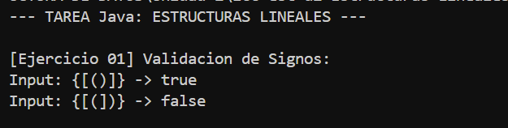

# Práctica de Laboratorio: Estructuras de Datos Lineales

**Estudiante:** Geovanny Cabrera  
**Materia:** Estructuras de Datos  
**Unidad:** 2 - Estructuras Lineales (Pilas y Colas)

---

## Descripción General
Este proyecto implementa soluciones algorítmicas para tres problemas clásicos utilizando estructuras de datos lineales (`Stack` y `Queue`). El objetivo es demostrar el dominio en la manipulación de estas estructuras tanto en **Java** como en **Python**.

El proyecto contiene:
1.  **Validación de Signos** (Uso de Pila/Stack)
2.  **Ordenamiento de un Stack** (Uso de Stack auxiliar)
3.  **Verificación de Palíndromos** (Uso de Colas/Queues)

---

## Ejercicio 01: Validación de Signos

### Descripción del Problema
Implementar un algoritmo que determine si una cadena de texto que contiene caracteres de agrupación `( ) { } [ ]` está correctamente balanceada.
* Todo símbolo de apertura debe tener su cierre correspondiente.
* Los símbolos deben cerrarse en el orden correcto (LIFO).

### Lógica de la Solución (`SignValidator`)
Se utilizó un **Stack (Pila)** para almacenar los caracteres de apertura encontrados.
1.  Se recorre el String carácter por carácter.
2.  Si es un signo de apertura (`(`, `{`, `[`), se hace `push` al Stack.
3.  Si es un signo de cierre:
    * Se verifica si el Stack está vacío (error).
    * Se hace `pop` del último elemento y se compara con el cierre actual. Si no coinciden en tipo (ej. `(` con `]`), la cadena es inválida.
4.  Al final, la cadena es válida solo si el Stack queda vacío.

### Evidencia de Ejecución (Java)

---

## Ejercicio 02: Ordenar un Stack

### Descripción del Problema
Dado un Stack de enteros, ordenar su contenido de manera que los elementos más pequeños queden en el tope.
**Restricción:** Solo se permite el uso de **un** Stack adicional como auxiliar, sin arrays ni listas.

### Lógica de la Solución (`StackSorter`)
Se implementó un algoritmo de ordenamiento utilizando un `auxStack`.
1.  Se extrae un elemento `temp` del stack original (`pop`).
2.  Mientras el `auxStack` no esté vacío y su tope sea **mayor** que `temp`, movemos elementos del auxiliar de vuelta al original. Esto "hace espacio" para insertar `temp` en su posición correcta.
3.  Se inserta `temp` en `auxStack` (`push`).
4.  Se repite hasta vaciar el original. Finalmente, se vuelcan todos los elementos del `auxStack` al original para obtener el orden deseado (menor en el tope).

### Evidencia de Ejecución (Java)

---

## Ejercicio 03: Palíndromo usando Colas

### Descripción del Problema
Determinar si una palabra es un palíndromo (se lee igual al derecho y al revés) utilizando Colas.

### Lógica de la Solución (`QueueUtils`)
Se utilizaron **dos Colas (Queues)** para comparar la secuencia.
1.  **Cola Original:** Almacena los caracteres del String en orden normal.
2.  **Cola Invertida:** Almacena los caracteres en orden inverso (recorriendo el String desde el final).
3.  Se extraen elementos de ambas colas simultáneamente (`remove/pop`). Si en alguna iteración los caracteres no coinciden, no es palíndromo.

### Evidencia de Ejecución (Java)
*(Véase la captura anterior que incluye la ejecución de ambos ejercicios)*

---

## Ejecución en Python
El proyecto también incluye la implementación de los tres ejercicios en Python.

### Evidencia (Python)

